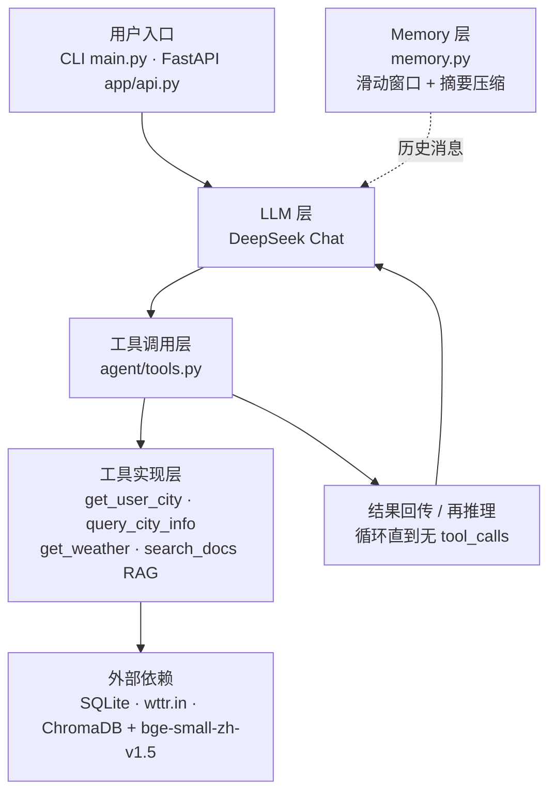

# AI Agent

> 基于 DeepSeek **Function Calling** 的智能助手 —— 不依赖 LangChain，从零实现 Agent 循环、**RAG** 知识库检索与多轮对话记忆，支持 CLI 与 HTTP 两种接入方式。

[](https://www.python.org/)
[](./LICENSE)
[](./tests)
[-success)](./scripts/eval.py)
[](https://platform.deepseek.com/)
[](https://fastapi.tiangolo.com/)

## 简介

这是一个完整的 **AI Agent** 工程实现：模型自主决定调用哪些工具、多轮工具调用后汇总作答，并可检索本地知识库。项目**不使用 LangChain / LangGraph 等框架**，所有核心机制（Agent 循环、工具调度、记忆管理、检索增强）均为手写，便于完整掌控与定制。

**技术栈**：Python 3.10 · DeepSeek API (`openai` SDK) · FastAPI · ChromaDB · SQLite · sentence-transformers (`bge-small-zh-v1.5`)

## ✨ 核心亮点

- **手写 Agent 循环**：不依赖 LangChain，从零实现 `LLM → 工具调用 → 结果回传 → 再推理` 的完整循环，深入理解 Function Calling 机制
- **死循环反馈注入**：检测到重复调用时不直接终止，而是注入纠正消息让模型自我修正
- **中文 RAG 检索增强**：ChromaDB + `bge-small-zh-v1.5` 本地嵌入模型，文档增量索引（MD5 diff + cosine 距离过滤），中文检索距离显著优于默认英文模型，中文嵌入模型随项目内置，离线加载
- **全链路可观测**：`ToolCallRecord` 记录每次工具调用的名称、参数、耗时、错误，API 层通过 `trace` 字段暴露
- **多轮记忆管理**：滑动窗口 + LLM 摘要压缩，超阈值时把旧对话滚动摘要，兼顾上下文长度与长期信息
- **工程化保障**：19 条 pytest 单测、20 条 QA 用例评测（实测 100% 成功率）、工具级可观测性、超时与死循环防护

## 🏗 Architecture



**Agent 循环**：每轮把当前消息历史发给 LLM → 若返回 `tool_calls` 则逐个校验并执行工具 → 结果以 `role: tool` 写回上下文 → 再次推理；直到模型不再调用工具（拿到最终答案）或触发 `MAX_STEPS` / 超时兜底。

## 🚀 Quick Start

环境要求：**Python 3.10+**

```bash
# 1. 获取代码
git clone https://github.com/Acaposa/agent-demo.git
cd agent-demo

# 2. 安装依赖
pip install -r requirements.txt

# 3. 配置 API Key（复制后填入 DEEPSEEK_API_KEY=sk-xxxx）
copy .env.example .env          # Linux / macOS: cp .env.example .env

# 4. 启动交互式对话
python main.py
```

> **关于嵌入模型**：RAG 检索依赖本地 `bge-small-zh-v1.5` 模型（约 100MB），代码默认开启离线加载（`HF_HUB_OFFLINE=1`），要求 `models/bge-small-zh-v1.5/` 目录下已存在模型文件。若尚未准备，请先把该模型下载到该目录（国内可设置 `HF_ENDPOINT=https://hf-mirror.com` 走镜像）。

## 📖 Usage

### CLI · 单次问答

```bash
python main.py "北京今天天气怎么样？"
```

```text
你：北京今天天气怎么样？
Agent：北京目前 ☁️ 阴天，气温约 29°C。
```

### CLI · 交互式多轮对话

```bash
python main.py
```

```text
=== AI Agent 已启动 ===
输入问题开始对话，输入 quit / exit / q 退出

你：用户1001所在城市的天气怎么样？
Agent：用户张三所在城市是北京，北京目前 ☁️ 阴天，气温约 29°C。
你：那这个城市的人口是多少？
Agent：北京位于北京市，人口约 2189 万。
你：q
再见！
```

### HTTP API

```bash
uvicorn app.api:app --reload --port 8000
```

```bash
curl -X POST http://127.0.0.1:8000/chat \
  -H "Content-Type: application/json" \
  -d '{"question": "北京天气怎么样"}'
```

```json
{
  "answer": "北京目前 ☁️ 阴天，气温约 29°C。",
  "success": true,
  "steps": 2,
  "trace": [
    {
      "name": "get_weather",
      "args": { "city": "北京" },
      "result_len": 13,
      "duration_ms": 342,
      "error": null
    }
  ],
  "aborted_reason": null
}
```

`trace` 字段返回每次工具调用的名称、参数、返回长度、耗时与错误，便于调试与监控。

## 🛠 功能特性

### 内置工具

| 工具 | 参数 | 数据来源 | 返回示例 |
|---|---|---|---|
| `get_user_city` | `user_id: str` | SQLite `users` 表 | `用户张三(ID: 1001）所在城市是北京` |
| `query_city_info` | `city: str` | SQLite `cities` 表 | `北京位于北京市，人口约2189万` |
| `get_weather` | `city: str` | `wttr.in` 接口 | `北京: ⛅️ +28°C` |
| `search_docs` | `query: str` | ChromaDB 向量库 | 带来源与距离标注的文档片段 |

新增工具只需三步：写实现函数 → 在 `tools` 列表加 schema → 注册到 `TOOL_REGISTRY` 与 `TOOL_SCHEMAS`，主循环会自动完成校验、执行、重试与记录。

### RAG 知识库

把 `.md` 文档丢进 `docs/`，Agent 在下次检索时自动增量索引：

- **段落切分**：按空行切段，超长段落按标点切句，单句超长时硬切兜底
- **增量更新**：基于文件 MD5 比对，只重建改动过的文档，自动清理已删除文档
- **距离过滤**：集合使用 cosine 空间，默认丢弃距离 > `0.5` 的片段

```bash
python -m scripts.rebuild_index    # 手动全量重建索引
```

### 多轮对话记忆

`AgentSession` 采用「滑动窗口 + LLM 摘要压缩」：非 system 消息数超过 `COMPRESS_THRESHOLD`（默认 16）时，把旧对话交给 LLM 合并成摘要，作为一条 system 消息插入上下文。摘要调用失败时保持原消息不动，不会打断对话。

### 抗幻觉设计

- **工具侧**：`get_weather` 内置非地球城市黑名单（火星、月球等），命中时不发请求，直接返回"无法查询"
- **提示词侧**：System Prompt 强制"回答必须基于工具真实数据"，遇到不合理数据不呈现具体数值，技术类问题必须先检索文档
- **参数侧**：工具名、必填参数、参数类型在执行前校验，非法调用以错误信息回传模型自我修正

## 🧠 设计要点

### 为什么手写循环而不用 LangChain？

框架把 `messages` 追加、`tool_calls` 解析、`role: tool` 回传这些细节封装掉了。手写一遍能完全掌控三件事：上下文里每条消息的形态、工具调用的调度顺序、异常与重试的边界。当需要定制中间步骤（比如注入纠正反馈、按步数限流、裁剪历史）时，改自己的代码比绕框架的抽象层更直接。

### 死循环怎么防？

采用**反馈注入**而非直接中断：为每次工具调用生成签名（`函数名:参数JSON`），当同一签名重复超过 `MAX_REPEAT`（默认 3 次）时**不再执行工具**，而是把"你已重复调用 N 次，结果不会改变，请说明原因"作为工具结果喂回模型，让它自我纠正。真正的无限循环由 `MAX_STEPS`（默认 10）与 60 秒总超时硬兜底。

### 记忆为什么用摘要压缩而非纯截断？

纯滑动窗口会把早期对话整段丢弃：用户先说过的偏好、Agent 已查到的结论一旦滑出窗口就消失。摘要压缩则在超阈值时让 LLM 把「已有摘要 + 被切掉的旧消息」合并成新摘要，作为 system 消息保留——上下文长度可控，长期信息不丢。

两个必须守住的约束：**切点必须落在 `user` 消息上**（否则会把 `assistant(tool_calls)` 与对应 `tool` 结果拆开，OpenAI 兼容接口会直接报错）；**保留区不少于 `COMPRESS_KEEP_RECENT` 条**，避免刚压缩完立即二次触发。

### 中文嵌入模型怎么选？

ChromaDB 默认的 `all-MiniLM-L6-v2` 只支持英文，实测中文查询距离普遍在 0.6 以上，命中率低。改用 `BAAI/bge-small-zh-v1.5` 后同一查询距离降到 0.32。选它而非 `paraphrase-multilingual-MiniLM-L12-v2`，是因为 bge 在中文短文本检索上更强、体积更小（约 100MB），适合本地部署。模型固定在 `models/` 下按本地路径加载，并设置 `HF_HUB_OFFLINE=1`，可完全离线运行。

## 🧪 Testing & Evaluation

### 单元测试（23 条）

```bash
pytest -v
```

| 文件 | 条数 | 覆盖内容 |
|---|---|---|
| `tests/test_tools.py` | 8 | 参数校验（未知工具 / 缺参 / 类型错误 / 正常）、城市查询、用户查询、非法城市天气 |
| `tests/test_loop.py` | 4 | 无工具调用直接回答、LLM 调用失败、任务超时、重复调用注入反馈 |
| `tests/test_memory.py` | 6 | 超阈值触发压缩、压缩失败保持原状、切点落在 user 消息、会话保存/恢复/不存在、无 session_id 跳过保存 |
| `tests/test_rag.py` | 5 | 空文本、短段落、超长无标点文本硬切、多段落切分,Query Rewrite 失败时回退原 query |


测试全程 mock LLM 客户端，不消耗 API 额度；数据库与文档目录通过 fixture 重定向到临时路径，不污染真实数据。

### Agent 评测（20 条 QA 用例）

```bash
python -m scripts.eval              # 控制台报告
python -m scripts.eval --markdown   # 生成 Markdown 报告
```

评测覆盖城市查询、天气查询、用户关联（多工具串联）、负向抗幻觉、RAG 检索五类场景，按「期望工具是否全部被调用 + 答案关键词是否命中」判定：

| 指标 | 数值 |
|---|---|
| 任务成功率 | **20/20 (100%)** |
| 平均步数 | 2.25 |
| 平均耗时 | 3.15s |

<details>
<summary><b>📁 Project Structure</b></summary>

```
.
├── main.py                 # CLI 入口（单次问答 + 交互式多轮）
├── logging_config.py       # 统一日志配置（文件轮转 + 可选控制台）
├── requirements.txt        # 依赖清单
├── LICENSE                 # MIT License
│
├── agent/                  # Agent 核心模块
│   ├── __init__.py         # 包初始化（设置 HF 镜像环境变量）
│   ├── config.py           # 全局配置中心（路径、常量、System Prompt）
│   ├── llm_client.py       # LLM 客户端（延迟初始化）
│   ├── loop.py             # Agent 主循环
│   ├── memory.py           # 会话记忆（滑动窗口 + LLM 摘要压缩）
│   ├── models.py           # 数据结构（AgentResult / ToolCallRecord）
│   ├── rag.py              # RAG 检索（ChromaDB 增量索引 + 语义搜索）
│   ├── session_store.py    # 会话持久化（SQLite）
│   └── tools.py            # 工具定义、参数校验、带重试执行
│
├── app/api.py              # FastAPI 服务入口（/chat、/health）
│
├── scripts/
│   ├── rebuild_index.py    # 全量重建 RAG 索引
│   └── eval.py             # Agent 评测脚本（20 条 QA + 多轮对话）
│
├── tests/                  # pytest 测试用例（23 条）
│   ├── conftest.py         # 共享 fixture（临时 DB / Docs）
│   ├── test_loop.py
│   ├── test_memory.py
│   ├── test_rag.py
│   └── test_tools.py
│
├── docs/                   # 知识库文档（Markdown，自动索引）
├── models/                 # 本地中文嵌入模型（bge-small-zh-v1.5）
├── chroma_db/              # ChromaDB 持久化存储（自动生成）
├── logs/                   # 日志目录
├── cities.db               # SQLite 数据库（城市 / 用户数据）
└── sessions.db             # SQLite 数据库（会话持久化，自动生成）
```

</details>

## 🗺 Roadmap

- [ ] SSE 流式输出（当前 `/chat` 为同步返回）
- [ ] 跨会话持久化记忆（接入 SQLite 或向量库）
- [ ] 评测集扩充至 30-50 条，并统计工具调用准确率与 token 成本
- [ ] 新增网络搜索、代码执行等工具，验证框架可扩展性

## 🤝 Contributing

欢迎提交 Issue 与 PR。开发流程：

```bash
pip install -r requirements.txt
pytest -v                            
```

## 📄 License

本项目基于 [MIT License](./LICENSE) 开源，Copyright (c) 2026 Acaposa。


